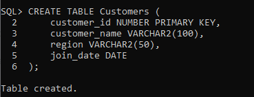
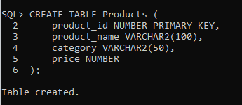
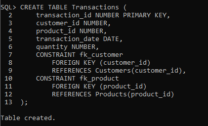

# Individual Assignment I: PL/SQL Window Functions Mastery Project
# Course: Database Development with PL/SQL (INSY 8311)

**Business Problem:** Improve profitability by focusing resources on high-value customers who contribute the most to the company's revenue.

----
# Step 1: Business Problem & Success Criteria
**Problem Definition:** The objective is to analyze customer data to identify and understand high-value customers. By leveraging window functions, we aim to segment the customer base and gain actionable insights that can be used to improve customer retention and profitability.

---
 **Five Measurable Goals:**

1. **RANK():** Identify the top 10% of customers by total revenue.

1. **SUM() OVER():** Calculate the cumulative revenue generated by each customer over the past year.

2. **LAG()/LEAD()**: Analyze the time gap between a customer's first and second purchase to identify customer retention patterns.

3. **NTILE(4):** Segment customers into four quartiles based on their total spending.

4. **AVG() OVER():** Calculate the average transaction value over a three-month rolling window for each customer.

---
# Step 2: Database Schema & ER Diagram
The following three tables were created to store the necessary customer, product, and transaction data.

---
**CREATING TABLES (DDL)**

 

 

 

---
**INSERTING DATA INTO TABLES (DML)**

 

 

 

# 2. Entity-Relationship Model
The transactions table links customers and products, representing a many-to-many relationship via Foreign Keys.

---
 

 

 

---
# Step 4: Window Functions Implementation & Analysis

**1. Ranking Function: RANK()**
SQL QUERY

