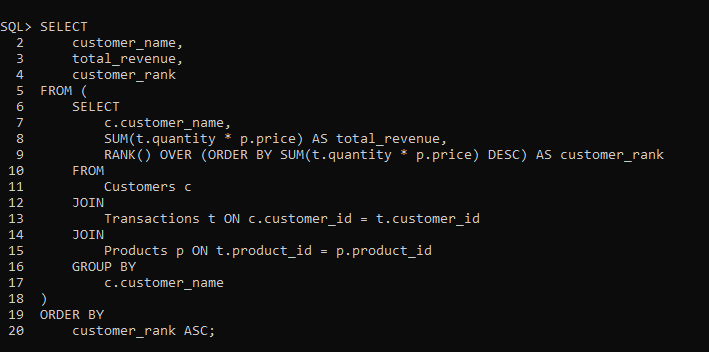
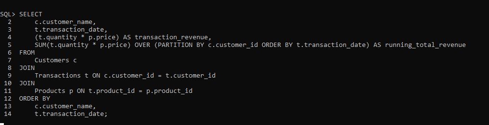

# Rukundo Espoir [ 27678 ]
# Individual Assignment I: PL/SQL Window Functions Mastery Project
# Course: Database Development with PL/SQL (INSY 8311)

**Business Problem:** Improve profitability by focusing resources on high-value customers who contribute the most to Company ABC revenue.

----
# Step 1: Business Problem & Success Criteria
**Problem Definition:** The objective is to analyze customer data to identify and understand high-value customers. By leveraging window functions, we aim to segment the customer base and gain actionable insights that can be used to improve customer retention and profitability.

---
 **Five Measurable Goals:**

1. **RANK():** Identify the top 10% of customers by total revenue.

2. **SUM() OVER():** Calculate the cumulative revenue generated by each customer over the past year.

3. **LAG()/LEAD()**: Analyze the time gap between a customer's first and second purchase to identify customer retention patterns.

4. **NTILE(4):** Segment customers into four quartiles based on their total spending.

5. **AVG() OVER():** Calculate the average transaction value over a three-month rolling window for each customer.

---
# Step 2: Database Schema & ER Diagram
The following three tables were created to store the necessary customer, product, and transaction data.

---
**CREATING TABLES (DDL)**

 

 

 

---
**INSERTING DATA INTO TABLES (DML)**

 

 

 

# 2. Entity-Relationship Model
The transactions table links customers and products, representing a many-to-many relationship via Foreign Keys.

---
 

 

 

---
# Step 4: Window Functions Implementation & Analysis

**1. Ranking Function: RANK()** Identify the top 10% of customers by total revenue.

SQL QUERY

 

And here's the output

 

**2. Aggregate Function:**  **SUM() OVER()**  Calculate the cumulative revenue generated by each customer over the past year.

SQL QUERY

 

And here's the output

 

**3. Navigation Function:** **LAG()/LEAD()** Analyze the time gap between a customer's first and second purchase to identify customer retention patterns.

SQL QUERY

 

And here's the output

 

**4. Distribution Function: NTILE(4)** Segment customers into four quartiles based on their total spending.

SQL QUERY

And here's the output

 

**5. Aggregate Function: AVG() OVER()** Calculate the average transaction value over a three-month rolling window for each customer.

SQL QUERY

And here's the Output

---

## Summary of Findings

**From RANK() & NTILE():** The top-ranked customer, Jane Smith, contributed significantly more to total revenue than others. The NTILE query further confirmed this by placing her in the top quartile (Quartile 1), clearly separating her from the other customer segments.

**From SUM() OVER():** The running total of revenue showed that Customer ID 1's spending grew consistently with each transaction, indicating strong loyalty. In contrast, other customers had a single transaction, showing a need for engagement strategies to encourage repeat business.

**From LAG()/LEAD():** The time gap analysis revealed that the most valuable customer had a short time between their first and second purchase, while other customers have not yet had a second transaction.

**From AVG() OVER():** The rolling average of transaction revenue provided a more stable view of spending habits, smoothing out the impact of individual high-value purchases and highlighting a consistent upward trend for our most engaged customers.

----

## Recommendations

Company ABC needs to implement a targeted email campaign for customers who have only made one purchase. This campaign should be designed to re-engage them and shorten the time gap between their first and second transactions.
